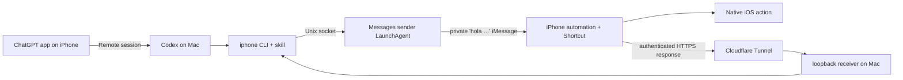

# Codex iOS Assistant

Control and inspect an iPhone from Codex on your Mac. This project connects a semantic `iphone` CLI to an iOS Shortcut over iMessage, and returns screen text, screenshots, clipboard contents, and alarm data through an authenticated Cloudflare Tunnel.

The intended experience is simple: open a Codex session from the ChatGPT app on your iPhone, ask Codex to interact with the phone, and let the Mac-hosted Codex session use the installed `iphone-control` skill.

> [!IMPORTANT]
> This is an early macOS/iOS project. Setup includes a few manual Apple UI steps, and some commands intentionally report `requested` because iOS does not provide an execution receipt.

## What it can do

- Read on-screen text or save a screenshot from the iPhone.
- Return the iPhone clipboard, list enabled alarms, create an alarm, or turn off every enabled alarm at an exact time.
- Open apps and deep links for Camera, Weather locations, Calendar dates, Calculator expressions, Messages, Find My, Uber, DoorDash, Spotify, Photos, Wallet, Notes, Books, and App Store pages.
- Open the Home Screen or Control Center; control timers, the flashlight, and Low Power Mode; place calls; and replace clipboard text.
- Search Mac Contacts and read local Messages history when the optional permissions and `imsg` dependency are installed.

The project never asks the iPhone Shortcut to send an ordinary message. Message composition opens a populated draft for the user to review.

## How it works



The background Messages sender is deliberate. It runs in the user's normal GUI session so a sandboxed Codex process does not need to resolve or automate Messages itself.

Read [Architecture](docs/architecture.md) for the protocol and trust boundaries.

## Requirements

- A Mac with Python 3.11+, Messages signed into iMessage, and Xcode Command Line Tools.
- An iPhone using the same Messages/iCloud setup, with iCloud sync enabled for Shortcuts.
- A domain managed by Cloudflare so the receiver can use a stable HTTPS hostname.
- The ChatGPT desktop and mobile apps if you want to control the Mac-hosted Codex session remotely.

Homebrew is the easiest way to install `cloudflared` and the optional `imsg` history tool.

## Install

```bash
git clone https://github.com/samin100/codex-ios-assistant.git
cd codex-ios-assistant
brew install cloudflared steipete/tap/imsg
./scripts/install
./scripts/setup-cloudflare
./scripts/install-services
./scripts/copy-shortcut
```

The scripts ask for only three private values:

1. An iMessage address that reaches your iPhone.
2. A stable HTTPS hostname such as `https://iphone.example.com`.
3. A strong receiver token, generated automatically.

Private configuration is written to `~/.config/codex-ios-assistant/`, never to this checkout. The last command places the configured Shortcut actions on the Mac clipboard. Create a blank shortcut in Shortcuts and press Command-V once, then create the personal Message automation on the iPhone.

Those Apple UI steps, permissions, Remote setup, and verification commands are covered precisely in the [Installation guide](docs/installation.md).

## First test

After the Shortcut and iPhone automation are installed:

```bash
iphone doctor
curl http://127.0.0.1:8787/health
iphone home
iphone screen read --timeout 30
iphone alarm list --timeout 30
```

`iphone home` should report `requested`; the command reached Messages, but there is no phone-side receipt. `screen read` and `alarm list` wait for a correlated response and report `completed`.

## Repository map

| Path | Purpose |
| --- | --- |
| `src/iphone_cli/` | CLI, sandbox-safe Messages bridge, response receiver, URL builders |
| `shortcut/actions.template.plist` | Sanitized source for the 95-action iOS Shortcut |
| `scripts/` | Configure, install, tunnel, LaunchAgent, and Shortcut clipboard tooling |
| `skills/iphone-control/` | Codex skill installed into `~/.agents/skills` |
| `contacts/` | Small Swift Contacts lookup helper |
| `tests/` | Python unit tests and Shortcut structural validation |
| `docs/` | Installation, architecture, maintenance, security, and troubleshooting |

## Documentation

- [Installation](docs/installation.md)
- [Commands and behavior](docs/commands.md)
- [Architecture and protocol](docs/architecture.md)
- [Shortcut maintenance and the Command-V technique](docs/shortcut.md)
- [Cloudflare Tunnel](docs/cloudflare.md)
- [Security](docs/security.md)
- [Troubleshooting](docs/troubleshooting.md)
- [Development](docs/development.md)

## License

MIT. See [LICENSE](LICENSE).
